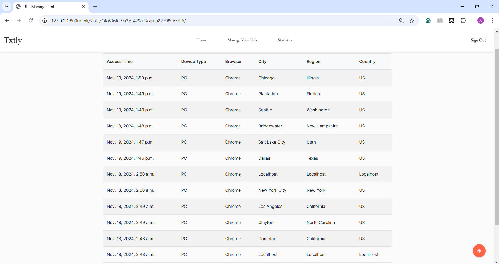
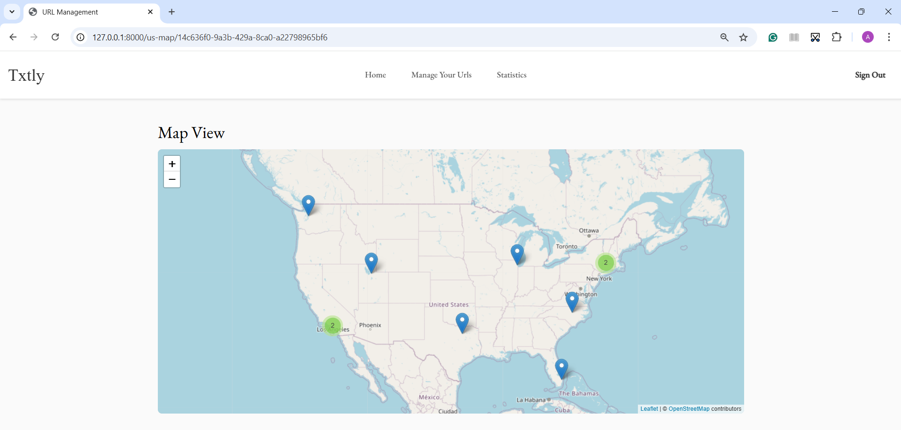
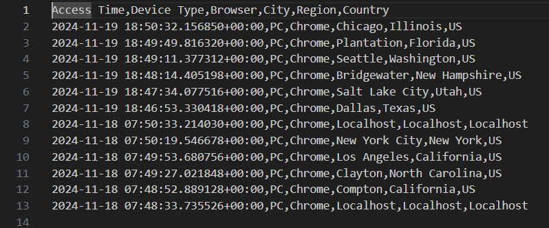

# URL-Shortner - Group 15 Project 3 Fall 2024 🔗
[](https://github.com/NCSU-CSC510-Group-BHAKQH/URL-Shortner/releases)
[](https://github.com/NCSU-CSC510-Group-BHAKQH/URL-Shortner/releases)
[](https://github.com/NCSU-CSC510-Group-BHAKQH/URL-Shortner/network)
[](https://github.com/NCSU-CSC510-Group-BHAKQH/URL-Shortner/stargazers)
[](https://github.com/NCSU-CSC510-Group-BHAKQH/URL-Shortner/graphs/contributors)
[](https://github.com/NCSU-CSC510-Group-BHAKQH/URL-Shortner/graphs/commit-activity)
[](https://github.com/NCSU-CSC510-Group-BHAKQH/URL-Shortner/blob/develop/LICENSE)

<!-- [](https://github.com/NCSU-CSC510-Group-BHAKQH/URL-Shortner/actions/workflows/unit_test.yaml) -->

<!-- [](https://github.com/NCSU-CSC510-Group-BHAKQH/URL-Shortner/actions/workflows/linting_workflow.yml) -->

[](https://doi.org/10.5281/zenodo.14026734)

[](https://github.com/NCSU-CSC510-Group-BHAKQH/URL-Shortner/issues)
[](https://codecov.io/gh/NCSU-CSC510-Group-BHAKQH/URL-Shortner)

---
Txtly URL-Shortner
---

Welcome to URL-Shortner by Group 15!

Inspired by Group 5's fantastic groundwork, we've taken the core functionality of a URL shortener and enhanced it with new, powerful features to provide a seamless user experience. Our goal? To make URL shortening simple, customizable, and insightful.

---
📖 About the Project
---

Have you ever:

Struggled to type out long URLs on your phone?
Sent the wrong link by mistake?
Wanted to keep the same URL but update the destination over time?
If any of this sounds familiar, URL-Shortner is here to help! Designed for simplicity and flexibility, URL-Shortner lets you shorten, customize, update, and delete URLs with just a few clicks. Plus, you can upload multiple URLs in bulk, manage them all from one place, and gather performance insights through our analytics dashboard.


If you answered yes to any of the above questions, URL-Shortner is here to simplify your URL management! With this tool, you can create short, memorable links that are easy to share and update as needed. Want to personalize your links? Add custom stubs to make URLs align with your brand. Plus, track link performance with analytics to understand your audience, or upload multiple links at once to manage them all from one place. Whether you’re looking to customize, analyze, or bulk-manage URLs, URL-Shortner has you covered!


https://github.com/user-attachments/assets/851e115f-19e7-43c7-9f98-48b024901422

---
🚀 Key Features
---

🔗 Customizable Short URLs
Stand out with custom URL stubs! Now, you can create branded, memorable links that align perfectly with your identity and boost user engagement.

📊 Comprehensive URL Analytics
Get insights on link performance! URL-Shortner’s analytics track clicks and other metrics to help you understand your audience and fine-tune your campaigns.

📋 Bulk URL Upload
Manage large volumes of URLs with ease using our bulk upload feature. Simply upload a CSV file or comma-separated list of URLs and let URL-Shortner do the rest!

🔒 Secure & Reliable URL Management
We prioritize your data’s security. With encrypted management for all URLs, your links are safe and fully manageable at any time. Delete, update, or redirect URLs as needed.

---
🛠️ What’s New?
---

Enhanced UI/UX
A refined user interface designed for simplicity and ease of use.

User Login & Ownership of URLs
Sign up and manage your URLs like never before. Only you can edit or delete the links you've created, adding a new layer of security and reliability.

Custom URL Creation
Your URLs, your way! Choose a custom stub to make links recognizable and brand-aligned.

Advanced Analytics
Track how often your links are clicked, export them for more detailed understanding, and analyze link performance to better connect with your audience.

### Installation Steps
#### 1. First install required MySQL dependencies
##### Linux
```
sudo apt update
sudo apt install libmysqlclient-dev mysql-server mysql-client
```
##### MacOS
```
brew install mysql
```

#### 2. Install Python packages
```
cd url_shortner_server
pip install -r requirements.txt
```

#### 3. Sign up for VirusTotal and retrieve an API key
  1. Sign up [here]([https://www.virustotal.com/gui/join-us](https://ipinfo.io/signup)). We _**strongly**_ recommend signing up with your GitHub account.
  2. Follow [these instructions](https://docs.virustotal.com/docs/api-overview) to find your API key.
  3. Create a `.env` file in the `URL-Shortner/url_shortner_server/shortner` directory.
    
    touch URL-Shortner/url_shortner_server/shortner/.env 
  4. Paste your API key in like so:

    VIRUSTOTAL_API_KEY=...

#### 4. Sign up for IP Info and retrieve an Access Token
  1. Sign up [here](https://www.virustotal.com/gui/join-us). We _**strongly**_ recommend signing up with your GitHub account.
  2. Follow [this link](https://ipinfo.io/account/token) to find your Access Token.
  3. Update the `.env` file in the `URL-Shortner/url_shortner_server/shortner` directory.
  4. Paste your Access Token in like so:

    IPINFO_API_TOKEN=...

#### 5. Create a MySQL database on your system
```
# Login to MySQL
sudo mysql -u root -p
CREATE DATABASE urlshortner;
CREATE USER 'root'@'localhost' IDENTIFIED BY 'admin123';
GRANT ALL PRIVILEGES ON urlshortner.* TO 'root'@'localhost';
FLUSH PRIVILEGES;
```

#### 6. Run Migrations and Start server
```
python3 manage.py migrate
python3 manage.py runserver
```

#### 7. Navigate to http://127.0.0.1:8000/

You can then go ahead and sign up by giving basic details. We do not ask for credit cards, or any other PII as your data is precious!


Enter the long version of the URL you want to generate a short version and click **Generate**. You also have the capability to create a custom URL for your application. We have included standards and protection to avoid SQL Injection attacks.


You will be redirected to a page listing all the URLs you have made and you can see which URL you made earlier


You can also delete individual or all the URLs from the listing page. 


We have also added a new feature! You can analyze how much your short URLs are being used for better analysis and tracking. Additionally, you can also export the statistics of the clicks for all the URLs in a CSV file.


You no longer need to remember the special code that our beloved previous contributors had! Since you have an account you 
can always manage your URLs!

---

## Render Deployment
This website is now hosted on Render! Each commit to the main branch will redeploy the service.

Visit at [https://url-shortner-srt8.onrender.com](https://url-shortner-srt8.onrender.com)

## Device and Browser Tracking
The system now tracks devices and browsers that access the short URLs created using our URL Shortener. This helps enhance the analytics by tracking users' devices and browsers, providing deeper insights into how and where links are accessed.

## Geo-Location Details
The information about the city, region, and country from which the short URLs are accessed is now recorded using Geo-Location tracking. IPInfo API was used to gather location details from the IP address of the device accessing the link. This introduces location-based tracking within the analytics dashboard to help users better understand geographic engagement trends for their links. 



## New 'Map View' Feature
A map of the USA has been integrated, displaying markers at all the locations where a specific short URL has been accessed. Leaflet CSS was used to introduce a Map to our site.



## CSV file for Stats
A new CSV file can be exported with the newly acquired device, browser, and geo-location details for each short URL created. This is in addition to the existing CSV file with the count of 'hits' for each short URL. 



## We love our contributors ❤️❤️

Make a [pull request](https://github.com/NCSU-CSC510-Group-BHAKQH/URL-Shortner/compare) to help contribute.

We reference our UI from Zenblog.

This project is built upon the earlier project - [previous version](https://github.com/AkashSarda3/URL-Shortner)
